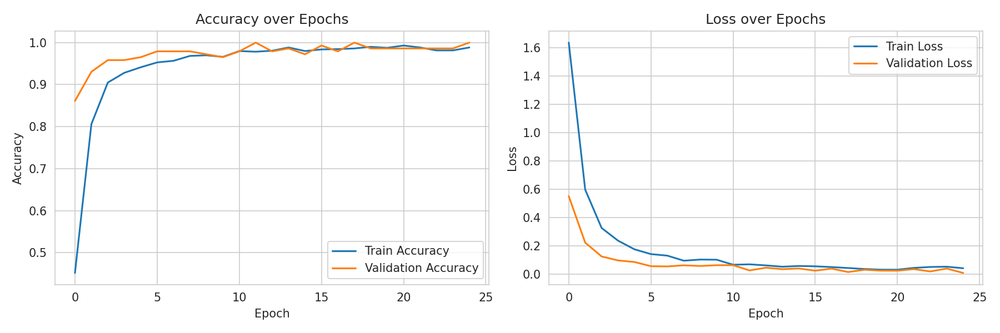
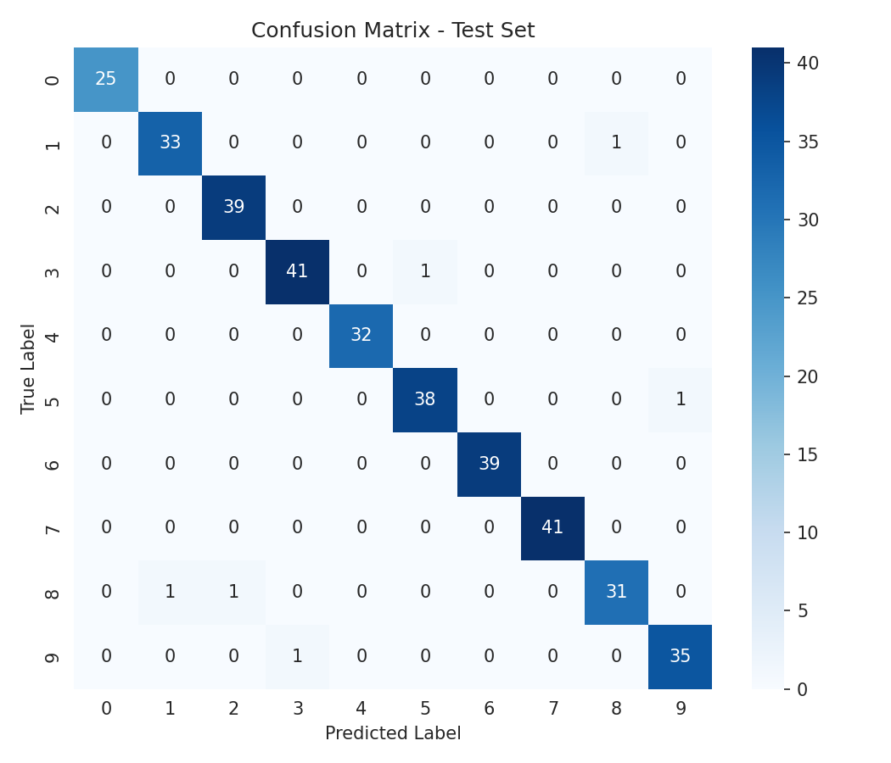

# Handwritten Digit Recognition System

**Kinetrexa Software Pvt. Ltd. — AI & Machine Learning Internship**
**Capstone Project (Task 5)**

| | |
|---|---|
| **Applicant** | Tailor Dhruvi Jagdishbhai |
| **Application ID** | KTS020260716309 |
| **Internship Domain** | AI & Machine Learning |
| **Project** | Handwritten Digit Recognition (Capstone) |

---

## 1. Overview

This project is an end-to-end **handwritten digit recognition system** built with a
Convolutional Neural Network (CNN). Given an image of a handwritten digit (0–9), the
model predicts which digit it is. The project includes data preprocessing, model
training and evaluation, a command-line prediction tool, and an interactive Streamlit
web app.

## 2. Dataset

- **Primary dataset:** [MNIST](http://yann.lecun.com/exdb/mnist/) — 70,000 grayscale
  images (28×28 px), 60,000 for training and 10,000 for testing. This is the exact
  same data distributed on Kaggle as the
  [**Digit Recognizer**](https://www.kaggle.com/competitions/digit-recognizer)
  competition dataset, and is the standard benchmark for this task. It is loaded via
  `tensorflow.keras.datasets.mnist`, which mirrors the official Kaggle/LeCun files.
- **Offline fallback:** If no internet connection is available, the code automatically
  falls back to scikit-learn's bundled *Optical Recognition of Handwritten Digits*
  dataset (1,797 images, 8×8 px, upsampled to 28×28) so the project remains fully
  runnable in any environment without extra setup.

> To use the full 70,000-image Kaggle/MNIST dataset, simply run this project on a
> machine with internet access (e.g. Google Colab, GitHub Codespaces, or a local
> machine) — no code changes needed. Alternatively, download `train.csv` /
> `test.csv` directly from the Kaggle Digit Recognizer page and adapt
> `src/data_loader.py` to read the CSVs if a fully offline Kaggle copy is preferred.

## 3. Project Structure

```
handwritten-digit-recognition/
├── notebooks/
│   └── Handwritten_Digit_Recognition.ipynb   # Full walkthrough: EDA -> training -> evaluation
├── src/
│   ├── data_loader.py     # Dataset loading (MNIST + offline fallback)
│   ├── model.py            # CNN architecture
│   ├── train.py             # CLI training script
│   └── predict.py           # CLI single-image prediction script
├── app/
│   └── app.py                # Streamlit web app (draw or upload a digit)
├── models/
│   └── digit_recognition_model.h5   # Trained model
├── reports/
│   ├── figures/
│   │   ├── training_curves.png
│   │   └── confusion_matrix.png
│   ├── metrics.json
│   └── Project_Report.pdf    # Full project report
├── requirements.txt
└── README.md
```

## 4. Model Architecture

A compact CNN designed for grayscale digit images:

```
Input (28x28x1)
 -> Conv2D(32, 3x3, ReLU) -> MaxPooling2D
 -> Conv2D(64, 3x3, ReLU) -> MaxPooling2D
 -> Flatten
 -> Dense(128, ReLU) -> Dropout(0.5)
 -> Dense(10, Softmax)
```

Optimizer: Adam | Loss: Sparse Categorical Crossentropy | Metric: Accuracy

## 5. Results

| Metric | Value |
|---|---|
| Test Accuracy | **98.33%** |
| Test Loss | 0.068 |
| Training epochs | 25 |
| Batch size | 32 |

*(Metrics above are from the offline fallback dataset run included in this repo.
Training on the full 60,000-image MNIST set typically yields ~99% test accuracy.
See `reports/metrics.json` for the exact numbers from the last run, and
`reports/figures/` for the training curves and confusion matrix.)*




## 6. Setup

```bash
git clone <your-repo-url>
cd handwritten-digit-recognition
pip install -r requirements.txt
```

## 7. Usage

### Train the model
```bash
python src/train.py --epochs 25 --batch-size 32
```
This loads the dataset, trains the CNN, saves the trained model to
`models/digit_recognition_model.h5`, and writes evaluation plots to
`reports/figures/`.

### Predict a single image (CLI)
```bash
python src/predict.py --image path/to/digit.png
```

### Run the interactive web app
```bash
streamlit run app/app.py
```
Draw a digit on the canvas or upload an image, and the app returns the predicted
digit along with a confidence chart.

### Explore the full notebook
Open `notebooks/Handwritten_Digit_Recognition.ipynb` in Jupyter to see the complete
EDA, training, and evaluation walkthrough with explanations.

## 8. Deliverables Checklist

- [x] Public GitHub Repository
- [x] Complete Source Code (`src/`, `app/`)
- [x] Jupyter Notebook (`notebooks/Handwritten_Digit_Recognition.ipynb`)
- [x] Trained AI/ML Model (`models/digit_recognition_model.h5`)
- [x] README Documentation (this file)
- [x] Project Report — PDF (`reports/Project_Report.pdf`)

## 9. Author

**Tailor Dhruvi Jagdishbhai**
AI & Machine Learning Intern — Kinetrexa Software Pvt. Ltd.
